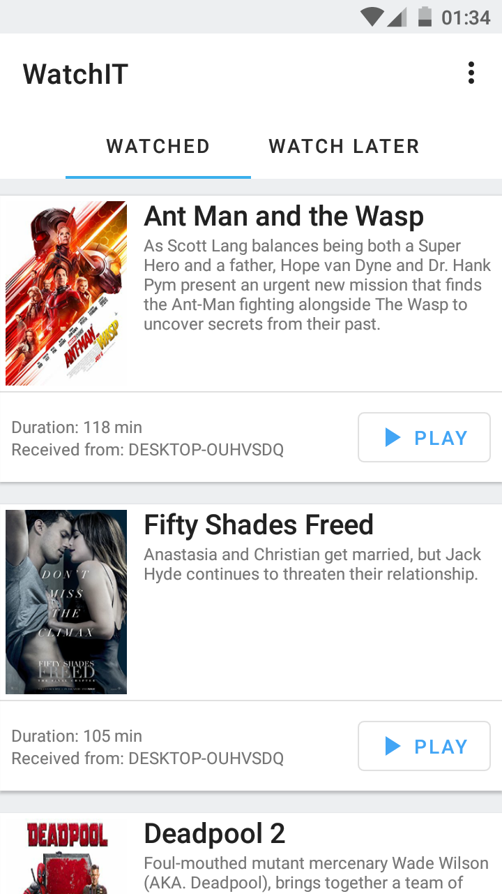
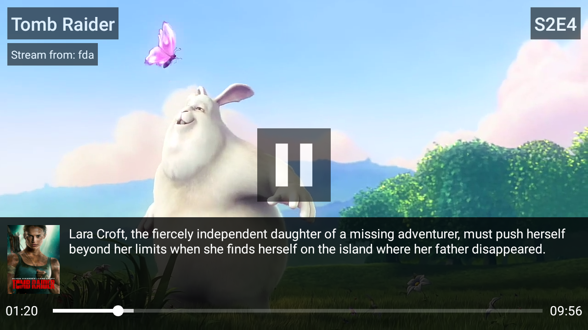

# 
WatchIT Android Application is responsible to play streamed movies and tv shows from your PC on your mobile device

[Download APK](https://github.com/tsvetilian-ty/WatchIt-Android-Client/releases) | [WatchIT Server](https://github.com/tsvetilian-ty/WatchIt-Server/) | [Desktop Client](https://raw.githubusercontent.com/tsvetilian-ty/WatchIt-Desktop-Client)

## Contents

- [Usage](#usage)
- [Screenshots](#screenshots)
- [License](LICENSE.md)

## Usage
The application uses FCM (Firebase Cloud Messaging) to use it you are required to download [google-services.json](https://support.google.com/firebase/answer/7015592?hl=en#android) file and put it in your application root directory

## Screenshots
None of the movies shown on the screenshots below are the "real" movies! 
We use movies with public access from [this gist](https://gist.github.com/jsturgis/3b19447b304616f18657), the calls to [OMDb API](http://www.omdbapi.com/) are build based on [directory structure](https://github.com/tsvetilian-ty/WatchIt-Desktop-Client/blob/master/README.md#user-guide) not the video file itself! 

#

